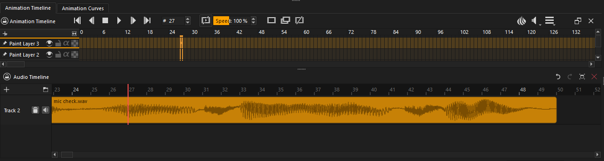
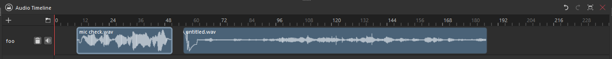

# Audio Timeline — Krita plugin

_(I had some free time, so i did it, because I
needed it, and because unfortunately it seems after quite a few years the
actual developers didn't have the resources to implement something similar
yet. Not perfect, but gets the job done 🤷‍♂️)_

A dockable multi-track audio timeline for Krita, synced with Krita's own
animation timeline via polling. Drag audio clips around, scrub either
timeline, and let the other one follow.

## Install

1. Locate your Krita resources folder: **Settings → Manage Resources… →
   Open Resource Folder**.
2. Copy both `audiotimeline.desktop` and the `audiotimeline/` folder into
   the `pykrita` subfolder there (create `pykrita/` if it doesn't exist).
   **Don't copy any `__pycache__` folder** — if one exists from a previous
   copy, delete it first (see Troubleshooting).
3. Restart Krita.
4. **Settings → Configure Krita… → Python Plugin Manager** → tick
   "Audio Timeline" → restart Krita again.
5. **Settings → Dockers → Audio Timeline** to show the panel.
6. Before you start using it, read [Known limitations](#known-limitations)
   — a couple of Krita's own behaviors around playback and scrubbing are
   easy to mistake for bugs if you don't know about them up front.

## Tested on

- **Windows 11**, Krita 5.3.2.1
- **Ubuntu 24.04.4**, Krita 5.3.2.1 _(on here, scrubbing with clicking and dragging on the animation timeline did not keep the playhead in sync, only using the arrows / the forward & back buttons did)_

## Features

  
  
   
  
  

- **Adapts to your Krita theme.**
- **Add Track** creates a new lane.
- **Import Audio…** loads an audio clip starting at the current playhead
  frame (see [Supported audio formats](#supported-audio-formats) below).
- Click/drag in the **ruler** (top strip) or empty lane space to scrub —
  this calls `Document.setCurrentTime()`, so Krita's own canvas and native
  timeline follow along.
- Drag a **clip** to move it earlier/later, or onto a different track.
  Clips can't be dropped on top of each other — the plugin nudges them
  into the nearest free gap instead.
- Double-click a track's name to **rename** it; the small button in a
  track's header deletes it.
- Select a clip and press **Delete/Backspace**, or right-click it, to
  remove it.
- **Ctrl + scroll** zooms the timeline horizontally.
- **Mute** a track with the small **Audio** button in its header — this
  actually removes it from the next mixdown (see below), not just a
  local UI toggle.
- Its own **Undo/Redo** buttons and Ctrl+Z/Ctrl+Y shortcuts, independent
  of Krita's canvas undo history (see [Undo/redo](#undo-redo-is-not-kritas-own) below).
- Playback itself is handled entirely by **Krita's own native audio
  engine**, the same one behind "Import Audio for Animation" — see
  [How playback audio actually works](#how-playback-audio-actually-works-mixdown--kritas-native-audio-track)
  below. This docker's job is purely to manage the virtual multi-track
  layout and keep Krita's single audio track in sync with it.

## How the sync actually works

`libkis` (Krita's Python API) has no "current frame changed" signal, so
there's nothing to subscribe to. Instead, a `QTimer` polls
`Document.currentTime()` every ~40ms and diffs it against the last known
value:

- If Krita's frame changed since the last poll (native scrub, or
  playback), the docker mirrors that frame by moving its own playhead
  to match — the actual audio for that frame is already handled by
  Krita itself, playing the mixdown track (see below).
- If the user drags this docker's own playhead, it calls
  `Document.setCurrentTime(frame)` directly, so Krita's canvas updates
  immediately, and the poll loop picks up the same frame right after.

## How playback audio actually works: mixdown + Krita's native audio track

This plugin doesn't play audio itself. Every time you add, move, delete,
or mute a clip, it renders all unmuted tracks/clips down to a single
interleaved stereo WAV file (a "mixdown") on a background thread, and
hands that file to Krita via `Document.setAudioTracks([path])` — the same
mechanism as **File → Import Audio for Animation**. From there, Krita's
own native audio engine owns playback, scrubbing, and syncing that audio
to the animation timeline; this docker's whole job is to keep that one
mixdown file up to date and to keep its own multi-track view in sync with
Krita's single-track playhead.

One consequence: the mixdown re-renders after *every* audio-affecting
edit, so on a large project with many/long clips there can be a short
delay (shown by a small spinner in the docker's title bar) between an
edit and hearing it reflected during playback.

## Known limitations

- **Krita's frame stepping matters more than you'd expect.** Krita only
  actually plays back audio for a frame when it advances through that
  frame in its own animation timeline — not for arbitrary seeks. That
  means you'll hear sound scrubbing through frames by:
  - clicking or scrolling directly **on the frames** in Krita's animation
    timeline (**not** on its ruler — clicking/dragging the ruler doesn't
    trigger audio),
  - the **Left/Right arrow keys** while focus is in the animation
    timeline docker,
  - the timeline's **forward/back** step buttons (or whatever keys
    they're bound to).

  Seeking or scrubbing from *this* docker's own timeline/ruler moves
  Krita's current frame via `Document.setCurrentTime()`, but that alone
  does not make Krita play the corresponding audio — you still need to
  step through frames one of the ways above to actually hear it. This is
  a limitation of Krita's own audio-for-animation feature, not something
  this plugin can work around from a Python script.
- **The playhead doesn't move during playback.** Krita fires no
  "playback started/stopped" event for plugins to hook into, and
  `Document.currentTime()` itself stays frozen at the frame playback
  started from for as long as it's running — it only updates once
  playback has actually stopped. Since this docker's playhead is driven
  by polling that same value, it won't visibly advance while Krita is
  playing; it'll jump to the correct (now-current) frame the moment
  playback stops.
- **Undo/redo is not Krita's own.** Plugins have no access to Krita's
  built-in undo stack, so track/clip edits (add, move, delete, mute,
  rename) are tracked by a separate `QUndoStack` owned entirely by this
  plugin, with its own Undo/Redo buttons in the docker's title bar
  (Ctrl+Z/Ctrl+Y work too, while focus is in the docker). It has no
  effect on, and isn't affected by, Krita's own canvas undo history.
- **A few icons are reused/approximated, not native.** Some icons Krita's
  own dockers use internally aren't importable from a Python plugin (e.g.
  a proper float/restore glyph for the title bar) — those are swapped for
  the closest available themed or Qt-standard stand-in.
- **Only `.wav` is fully supported.** See
  [Supported audio formats](#supported-audio-formats).
- **Mixdown re-renders can cause performance hiccups.** Every
  audio-affecting edit (import, move, delete, mute) re-renders the *entire*
  mixdown from scratch, not just the changed clip — on a project with many
  tracks/long clips this can take noticeably longer (worse still without
  `numpy` available, since it then falls back to plain Python loops), and
  rapid successive edits queue up re-renders rather than overlapping them.
  You'll see a small spinner in the docker's title bar while a mixdown is
  in progress — if things seem to be lagging, check there first before
  assuming something's broken.
- Tracks/clips persist into the `.kra` file (see below), but only by file
  path — if a clip's source file is moved, renamed, or deleted, it's
  silently dropped on reload (same path-based-reference caveat Krita's
  own linked layers have).

## Supported audio formats

`.wav` is decoded with Python's stdlib `wave` module and always works.
`.mp3`/`.ogg`/`.flac` are only supported if [`pydub`](https://github.com/jiaaro/pydub)
*and* `ffmpeg` are both importable/available from Krita's own embedded
Python environment — which they typically aren't out of the box, since
installing packages into Krita's bundled interpreter isn't as
straightforward as a normal Python environment. In practice, treat `.wav`
as the only format guaranteed to work, and convert other formats to
`.wav` first if import fails with a message about `pydub`.

## Persistence: tracks/clips saved into the .kra file

The whole track/clip layout (names, mute state, each clip's file path,
start frame, fps) is serialized to JSON and stored via
`Document.setAnnotation("audiotimeline/state", ..., data)` on every edit
(add track, import, drag, mute toggle) — this rides along with Krita's
normal save, no extra step needed. On load, the docker reads it back via
`Document.annotation(...)`, rebuilds the tracks, and re-renders the
mixdown. Only the file *path* is stored, not the audio data itself, so
moving/deleting/renaming a source file after saving breaks that clip's
reference on the next load (it's skipped rather than crashing the load).

## Troubleshooting: plugin greyed out / won't disable / no docker appears

This is a **plugin import error**, not a missing-docker problem. Do this,
in order:

1. **Settings → Configure Krita… → Python Plugin Manager** → hover over
   the greyed "Audio Timeline" entry. Krita shows a tooltip with the
   actual Python traceback that broke the import — start there, always.
2. If you can't see it or need more, launch Krita from a terminal /
   command prompt and look for `krita.scripting:` lines in the output —
   that's where the traceback also gets printed.
3. **Delete `__pycache__`** inside the plugin's folder in your pykrita
   directory and restart Krita. Stale `.pyc` files from a previous copy
   of the plugin are a classic cause of "I fixed the bug but it's still
   broken."

## Where to take it from here

- Clip trimming & splitting.
- Per-track volume curves.

## Background & related reading

Krita has no built-in multi-track audio timeline; this plugin exists to
work around that gap using what `libkis` and Krita's audio-for-animation
feature already expose. Some relevant prior discussion and Krita's own
docs on the underlying audio feature:

- [Krita docs: Audio for Animation](https://docs.krita.org/en/reference_manual/audio_for_animation.html)
- [Audio waveform feature for final Krita 5.2 version](https://krita-artists.org/t/audio-waveform-feature-for-final-krita-5-2-version/75030/6)
- [Why can't Krita add audio like in other apps?](https://krita-artists.org/t/why-cant-krita-add-audio-like-in-other-apps-por-que-krita-no-puede-agregar-audio-como-en-otras-aplicaciones/150192)
- [I thought of an animation waveform work-around](https://krita-artists.org/t/i-thought-of-an-animation-waveform-work-around/116388)
- [Audio waveforms](https://krita-artists.org/t/audio-waveforms/152141/2)
- [Audio waveform](https://krita-artists.org/t/audio-waveform/96413)
</content>
